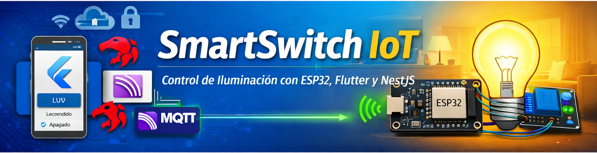
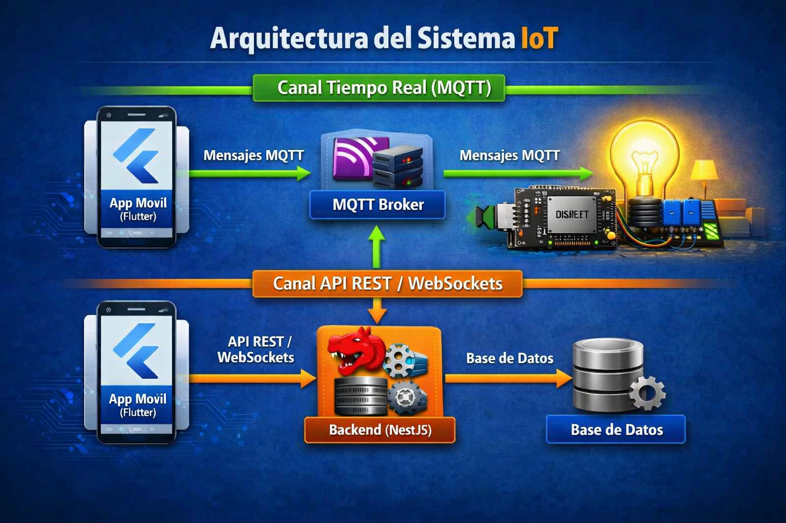
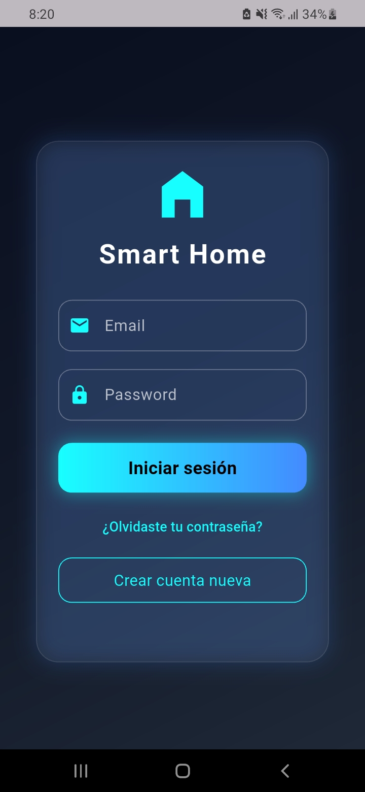
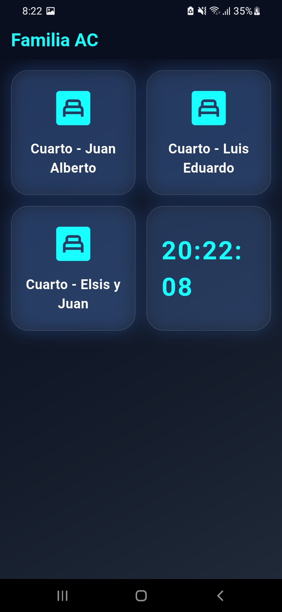
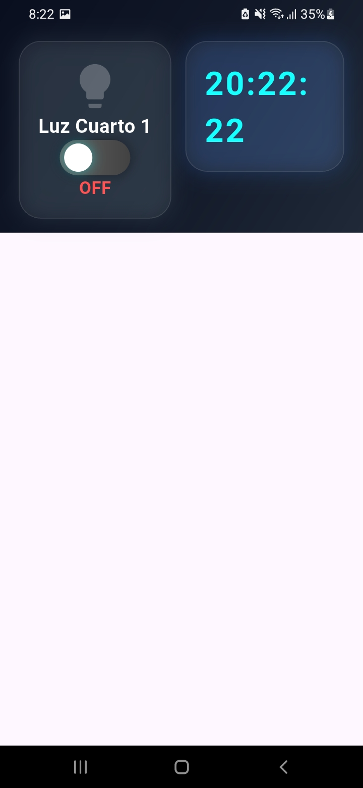
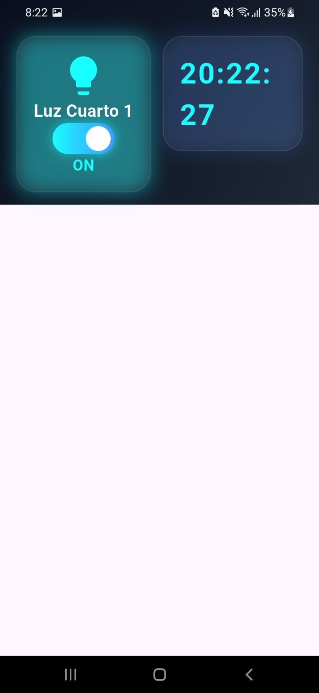

  

<h1 align="center">🔌 SmartSwitch IoT</h1>

Control de iluminación con ESP32, Flutter y NestJS

  
  
  
  

---

## 🚀 Descripción General

SmartSwitch IoT es un sistema completo de automatización que permite controlar luces desde:

- 📱 **Aplicación Flutter**
- 🔘 **Interruptor físico tradicional**
- 🌐 **ESP32 conectado por WiFi**

El sistema funciona incluso cuando el usuario apaga la luz desde el interruptor físico, gracias a una arquitectura eléctrica donde el ESP32 permanece energizado de forma independiente.

Este proyecto demuestra dominio en:

- Desarrollo móvil (Flutter)
- Backend profesional (NestJS)
- Comunicación en tiempo real (MQTT / WebSockets)
- Electrónica aplicada (ESP32 + relé + AC‑DC)
- Arquitectura IoT moderna

---

## 🧩 Arquitectura del Sistema

  

---

## 🔌 Diagrama Eléctrico

  

---

## 📱 Capturas de Pantalla

  
  
  
  

---

## 🛠 Tecnologías Utilizadas

<table>
  <tr>
    <td><b>Frontend</b></td>
    <td>Flutter, Material Design, HTTP, WebSockets</td>
  </tr>
  <tr>
    <td><b>Backend</b></td>
    <td>NestJS, JWT, REST API, MQTT</td>
  </tr>
  <tr>
    <td><b>Hardware</b></td>
    <td>ESP32, Relé 5V, AC‑DC 110/220V→5V, Interruptor físico</td>
  </tr>
</table>

---

## 📱 Funcionalidades Principales

- ✔ Login con JWT  
- ✔ Dashboard IoT  
- ✔ Control remoto desde la app  
- ✔ Control físico tradicional  
- ✔ Control híbrido (modo Sonoff)  
- ✔ Estado en tiempo real  

---

<h2>▶️ Cómo Ejecutar el Proyecto</h2>

<h3>1. Backend (NestJS)</h3>
<pre><code>npm install
npm run start:dev
</code></pre>

<h3>2. MQTT Broker</h3>
<pre><code>mosquitto
</code></pre>

<h3>3. Flutter App</h3>
<pre><code>flutter pub get
flutter run
</code></pre>

<h3>4. ESP32</h3>

  Subir el firmware al dispositivo <strong>(ESP32)</strong> usando <strong>Arduino IDE</strong>. 
  El firmware se encuentra en la carpeta <code>/firmware</code>.

